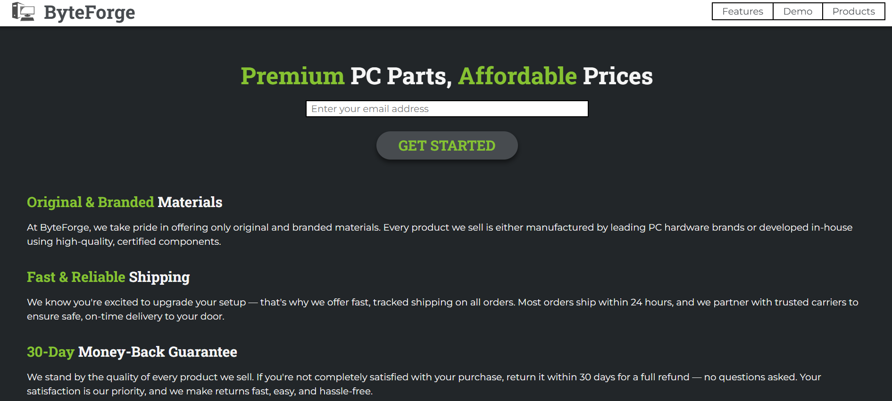

# 💻 Product Landing Page

## ℹ️ Product Showcase Site for "ByteForge"

This is a responsive product landing page for a fictional PC hardware store called **ByteForge**. It demonstrates a structured layout using HTML and CSS, and highlights practical use of forms, flexbox, embedded media, and grid-like content organization.

It was built entirely with HTML and CSS as part of the [**freeCodeCamp.org**](https://www.freecodecamp.org/learn/full-stack-developer/) CSS course.

---

## 🔍 Overview

This page introduces a tech store that sells premium PC parts at affordable prices. It includes multiple product listings, a call-to-action section with email form submission, and an embedded product demo from YouTube.

Each section was styled using semantic HTML and responsive CSS, with attention to accessibility and clean visual hierarchy. Layout adjustments are implemented using media queries to ensure usability across devices.

---

## ✨ Features

- Responsive layout using media queries
- Sticky header navigation with smooth scroll links
- Semantic and accessible HTML markup
- Email submission form with validation
- Embedded YouTube video demo
- Three fully styled product boxes with pricing, descriptions, and features
- "See More Products" button with call-to-action styling
- Mobile-friendly navigation and footer links

---

## 🧠 What I Learned

- How to structure a product landing page using semantic HTML
- Applying `position: sticky` for persistent headers
- Customizing form styles and handling accessibility for input fields
- Embedding YouTube videos responsively using `<iframe>`
- Designing modular product cards with flexbox
- Creating reusable design tokens using CSS custom properties
- Managing responsive behavior with `@media` and layout adaptation

---

## 🛠️ Tech Used

- HTML5
- CSS3
- Git
- GitHub
- Netlify

---

## 🚀 How to Run

1. Clone the repository
2. Open `index.html` in your browser

---

## 🌐 Live Demo

Or you can check out the 👉 [live website here](https://product-landing-page-fcc-jiro.netlify.app/)

---

## 🧑‍💻 Author

Created by **Elmar Chavez**

🗓️ Month/Year: **May 2025**

📚 Journey: **2nd** month of learning _frontend web development_.
